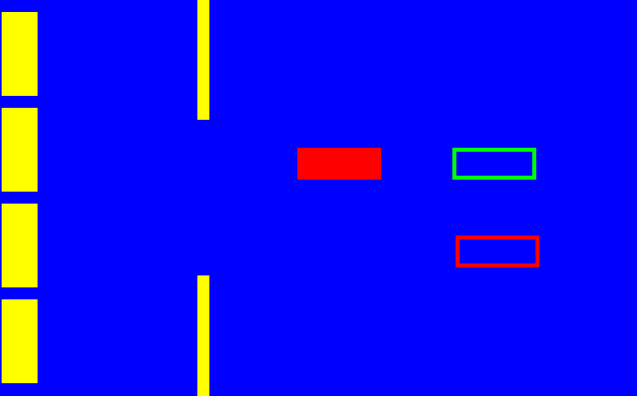

# [Example](https://github.com/Dead-TR/pixijs-port-task/tree/main)

## Run:
```bash
# clone the repo.
# --depth 1 removes all but one .git commit history (Optional).
git clone https://github.com/Dead-TR/pixijs-port-task.git

# go to the repo
cd pixijs-port-task

# install the dependencies via npm
npm install

# start the server in dev mode with HMR
npm run start
```
go to [http://localhost:1234](http://localhost:1234) in your browser. Done.

### npm scripts

* `npm run start` - runs the compiler and a server at the same time in dev mode with HMR (Hot Module Replacement) 🔥.
* `npm run build` - runs the compiler once and generates a production build.
* `npm run build_serve` - it makes a build and serves it to port 8080.
* `npm run test` - runs the unit tests (.spec.ts files).


## Screenshot:



## Technologies:
- JS
- TS
- Pixi
- Tween